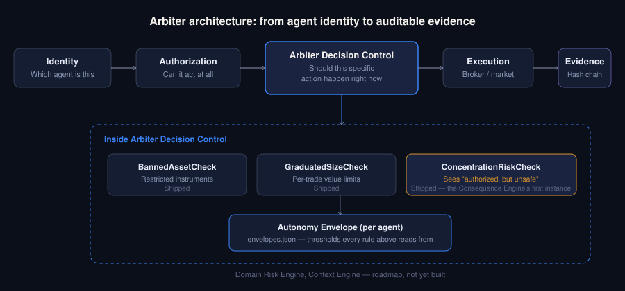
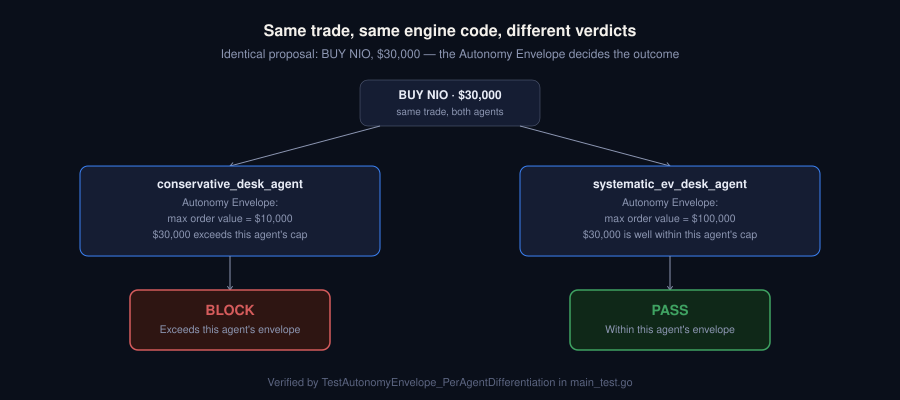
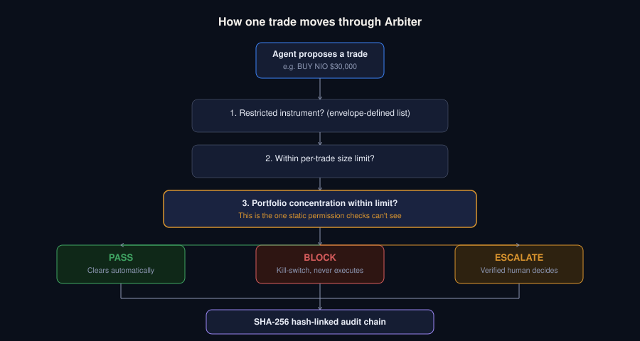

# Arbiter Core

An independent pre-trade risk engine and governance layer built specifically to manage non-deterministic execution risks originating from autonomous AI agents.



---

## System Status & Built Realities

This repository operates under a mandate of strict engineering honesty. No fabricated latency profiles, no unbuilt features presented as live.

| Component | Status | Description |
|-----------|--------|-------------|
| **Go Rules Core** | Shipped | Type-safe transaction processing — JSON ingestion, validation, and routing |
| **Graduated Action Matrix (PASS / BLOCK / ESCALATE)** | Shipped | Three-outcome decision schema based on exact value severity margins — replaces binary allow/deny |
| **0–100 Confidence Scorer** | Shipped | Per-decision risk confidence derived from rule severity weights |
| **Human-In-The-Loop Layer** | Shipped | Dashboard holds borderline trades pending manual review — logs reviewer identity, credentials (e.g., CQF), written reason, and nanosecond timestamp |
| **Tamper-Evident Ledger** | Shipped | SHA-256 hash-linked chain anchoring all engine decisions and human resolutions — each block's hash includes the previous block's hash, so altering any past record breaks the chain |
| **Alpaca Broker Kill-Switch** | Shipped (mock) | Code path calls `DELETE /v2/positions/{ticker}` — prints to console, ready for a live API key |
| **Concentration Risk Check** | Shipped | Detects when a trade that is individually authorized (not banned, within size limits) would still push single-ticker or sector exposure past a concentration threshold — escalates to human review based on portfolio context that static per-trade rules cannot see |
| **Autonomy Envelope** | Shipped | Per-agent artifact (`envelopes.json`) explicitly defining what each agent is authorized to do independently — restricted instruments, max order value, escalation band, concentration limits — versus what requires human judgment. Different agents can carry different authority without changing engine code |



---

## Roadmap: Formal Consequence-Detection Architecture

The Concentration Risk Check and Autonomy Envelope above are the first,
working instances of a broader architectural direction: separating
**authorization** (can this agent act at all) from **consequence
detection** (should this specific action happen, given real-time context).
The full target architecture is:

```
Identity → Authorization → Arbiter Decision Control → Execution → Evidence
```

Planned components inside Arbiter Decision Control (not yet built as
separate systems — the Concentration Risk Check and Autonomy Envelope are
currently the only implemented instances of this pattern):

- **Consequence Engine** — detects when an authorized action produces
  unacceptable downstream effects (concentration risk is the first example)
- **Domain Risk Engine** — domain-specific risk models beyond trading
- **Context Engine** — real-time market/regime context feeding the
  Consequence Engine
- **Escalation Engine** — the routing and resolution logic (already
  partially built as the Human-In-The-Loop Layer above)

This roadmap section is intentionally aspirational and labeled as such —
nothing here is claimed as shipped except the Concentration Risk Check and
the Autonomy Envelope.

---

## Evaluation Pipeline



```
POST /v1/risk/check
        ↓
┌──────────────────────────────────────────────────┐
│  Rule 1: BannedAssetCheck                        │
│    GHOST, TEST → HARD breach                     │
│                                                  │
│  Rule 2: GraduatedSizeCheck                      │
│    TotalValue > $50,000  → HARD breach           │
│    TotalValue > $40,000  → SOFT breach           │
│    TotalValue ≤ $40,000  → OK                    │
│                                                  │
│  Rule 3: ConcentrationRiskCheck                  │
│    Single-ticker exposure > $75,000 → SOFT       │
│    Sector exposure > $80,000        → SOFT       │
│    (can trigger even when Rules 1 & 2 are OK)    │
└──────────────────────────────────────────────────┘
        ↓
  HARD breach   → BLOCK   (confidence −40 to −50)
  SOFT breach   → ESCALATE (confidence −15 to −20, enters review queue)
  No breach     → PASS    (confidence 100)
        ↓
  SHA-256 hash computed and chained to previous block
  Decision stored in registry
  Human resolutions also chained — full immutable audit trail
```

---

## Quick Start

```bash
git clone https://github.com/Patience-Fuglo/arbiter-core.git
cd arbiter-core
go run main.go
```

Open `http://localhost:8080` to use the governance console.

No Docker, no Redis, no Rust toolchain required.

---

## Benchmarks & Verification

All performance figures below are **measured on real hardware** and are **reproducible** — clone the repo and run the commands yourself.

### Rule-evaluation latency (in-process)

```bash
go test -bench=. -benchmem
```

Measured results:

| Benchmark | Observed range | Notes |
|-----------|---------------|-------|
| `BenchmarkEngineRiskEvaluation` | **~18–25 µs per rule-check** | Single-core handler, in-process |
| `BenchmarkEngineRiskEvaluationParallel` | ~18–33 µs per rule-check | 4-goroutine parallel, in-process |

**Hardware:** Intel Core i5-8210Y @ 1.60 GHz (a low-power 2018 ultrabook CPU).

**Run-to-run variance is expected.** These figures are measured across multiple `go test -bench=.` runs on a shared OS — background processes, CPU frequency scaling, and GC timing all shift the number between runs. A range is more honest than a single point figure; it shows the real operating envelope rather than a cherry-picked best result.

**What this measures:** the time for the Go rule-evaluation handler to process one trade payload **in-process** (via `httptest`). It is the rule-check time only — it does **not** include network transport or broker round-trip. On faster hardware (a modern laptop or a cloud instance) the numbers will be lower.

### Tamper-detection test

```bash
go test -v -run=TestCryptographicTamperDetection
```

This appends real decision blocks to the hash-linked ledger, then deliberately alters a past record and asserts that verification **fails** — proving the audit chain detects retroactive tampering.

Expected output:
```
[TEST STEP 1] Appending valid blocks sequentially into the audit ledger...
[TEST STEP 2] Baseline audit ledger verification successful. Chain structure valid.
[TEST STEP 3] Executing deliberate data tamper on a historic block...
[TEST STEP 4] SUCCESS. Modification detected. Validation mismatch: cryptographic corruption at block tx_...
PASS
```

---

## API

### `POST /v1/risk/check`

```json
{
  "agent_id":    "quant_bot_1",
  "ticker":      "SOL",
  "quantity":    1.0,
  "price":       45000.0,
  "total_value": 45000.0
}
```

Response:
```json
{
  "id":               "tx_1719543200000000000",
  "outcome":          "ESCALATE",
  "confidence_score": 85,
  "rule_details": [
    { "rule_name": "BannedAssetCheck",   "triggered": false, "severity": "OK",   "reason": "Asset is cleared." },
    { "rule_name": "GraduatedSizeCheck", "triggered": true,  "severity": "SOFT", "reason": "Trade value of $45000.00 enters the borderline risk escalation band (> $40000.00)." }
  ],
  "prev_hash": "a3f9...",
  "hash":      "7c2b..."
}
```

### `GET /escalations`

Returns all trades currently awaiting human review.

### `POST /escalations/{id}/resolve`

```json
{
  "action":     "ALLOW",
  "reviewer":   "Jane Smith",
  "credential": "CQF",
  "reason":     "Reviewed counterparty exposure — within fund mandate."
}
```

`ALLOW` approves and logs. `REJECT` logs and calls `executeEmergencyFlatten()`.

---

## File Structure

```
arbiter-core/
├── main.go        # Rule engine, HTTP handlers, cryptographic ledger, broker stub
├── main_test.go   # Benchmarks + tamper-detection validation test
├── index.html     # Governance console (served at /)
├── go.mod
└── README.md
```

---

## Technical Optimization Roadmap (Not Yet Built)

| Item | Description |
|------|-------------|
| **Rust Performance Daemon** | Rewriting the hot-path evaluation loop in Rust to eliminate GC pauses and maximize sustained throughput |
| **AWS Nitro Secure Enclaves** | Sealing execution context inside hardware-encrypted partitions — memory isolation guarantees for institutional deployment |
| **eBPF Network Interception** | Moving packet capture to the Linux kernel space to bypass application-layer latency entirely |
| **Live Market Feed (Redis/Kafka)** | Streaming real-time top-of-book prices into a divergence engine for slippage detection |

---

## License

Proprietary. All rights reserved.
